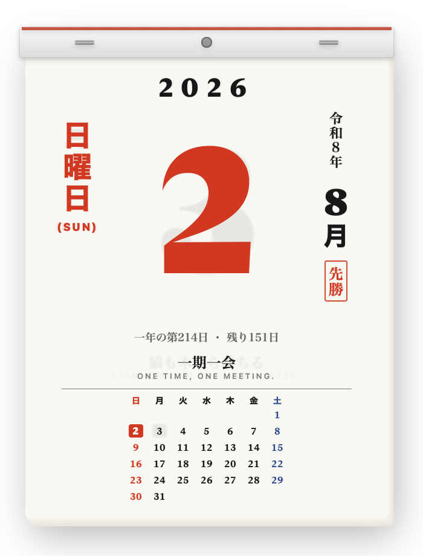
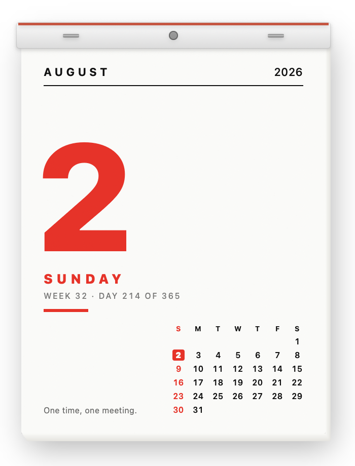
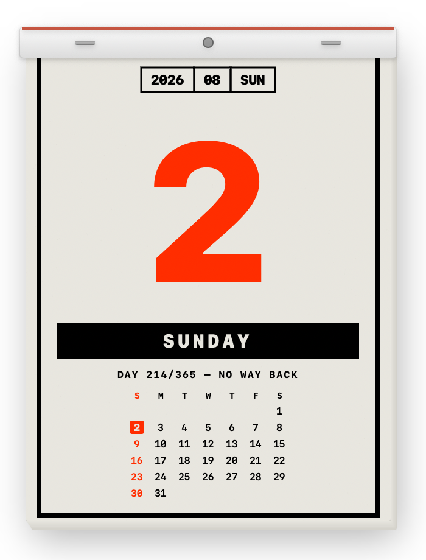
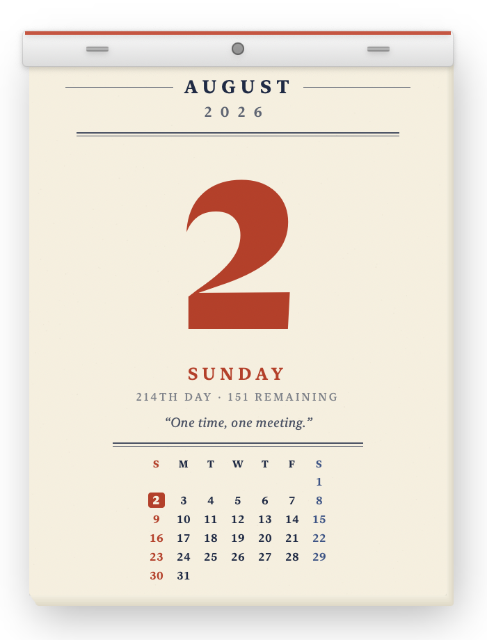
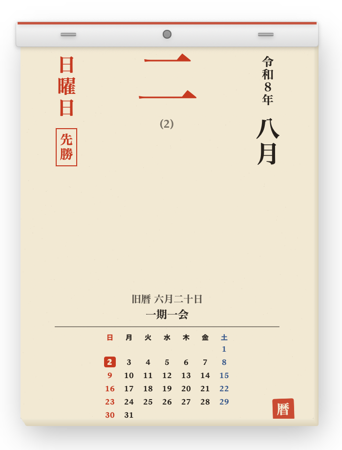
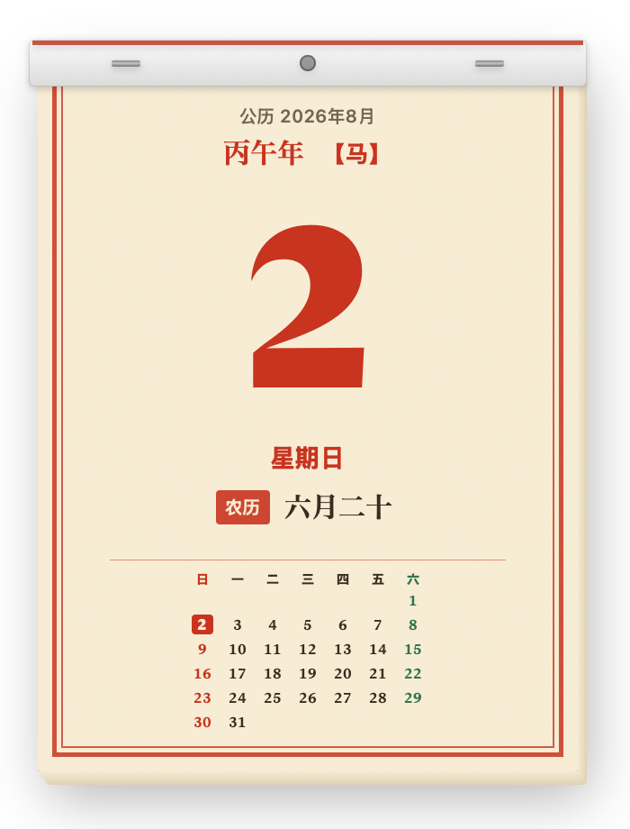
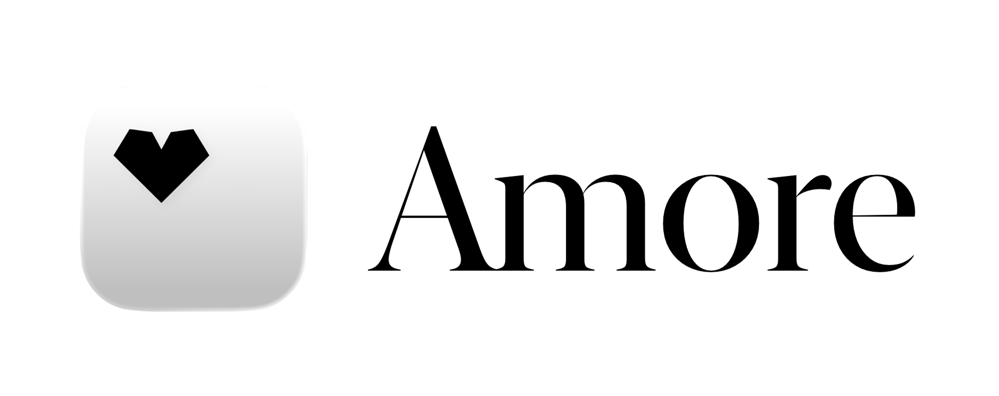

<h1 align="center">Himekuri 日めくり</h1>

<p align="center">
  
</p>

<p align="center">
  A Japanese page-a-day tear-off calendar that lives on your Mac desktop.
</p>

<p align="center">&nbsp;&nbsp;&nbsp;</p>

<p align="center">
  <a href="https://buymeacoffee.com/pluk">
    
  </a>
</p>

---

> When the day is done, grab the page and rip it off. The sheet resists, the
> fibers crackle, and the torn piece flutters off the bottom of your screen.
> Tomorrow is underneath. There is no undo — that's the whole point.

<p align="center">
  
</p>

## ⚠️ Read this first

**This project is days old.** Version 0.1.x, written over a couple of
evenings, open-sourced early because it's more fun that way.

- Expect bugs. There are no automated tests — none, not one.
- Layouts, preferences, and internals will change without ceremony.
- **Tearing is irreversible by design.** Release builds have no "Reset to
  Today" — if a bug tears a page you didn't mean to tear, that day is gone.
  Only development builds get an escape hatch.
- It has been tested on exactly one Mac. macOS 12–13 support is claimed by the
  deployment target and the code paths, not by anyone actually running it there.
- The animations are not where I want them (see [Help wanted](#help-wanted-the-animations)).

This is a little fun project — a toy about paper, not a productivity tool.
Nothing here is serious. Please don't run your life on it.

## Installation

Grab the signed and notarized DMG:

**[Download the latest build](https://api.amore.computer/v1/apps/pluk.himekuri/download)** ·
[himekuri.app](https://himekuri.app)

Himekuri lives in the menu bar and updates itself through Sparkle. There's no
Homebrew cask yet.

## Print styles

Six of them, switched from the menu bar. Same paper, same physics, different press.

<table>
  <tr>
    <td align="center"><br /><b>Shōwa Print</b><br /><sub>1960s Japanese print, the default</sub></td>
    <td align="center"><br /><b>Minimal Swiss</b><br /><sub>Grid, red, and a lot of air</sub></td>
    <td align="center"><br /><b>Brutalist</b><br /><sub>Heavy mono blocks</sub></td>
  </tr>
  <tr>
    <td align="center"><br /><b>Retro Office</b><br /><sub>American memo calendar</sub></td>
    <td align="center"><br /><b>Koyomi</b><br /><sub>Traditional lunar almanac</sub></td>
    <td align="center"><br /><b>Huangli</b><br /><sub>Chinese almanac (黄历)</sub></td>
  </tr>
</table>

## Features

- **Real paper physics** — the top sheet is a verlet-integrated 11×14 grid with
  inextensible distance constraints and stiff bending constraints
  (`Paper/PaperSim.swift`), simulated in 3D so the bulge toward you is what
  shortens the on-screen page, exactly like real paper. It's rendered by warping
  the printed page through an `SKWarpGeometryGrid` every frame.
- **Tearing that behaves like tearing** — pull down, or flip the sheet up from
  the bottom edge. Fibers part along the staple seam, stress focuses at the
  crack tip, and past a threshold the crack runs away and the page comes off in
  your hand. Pull and let go and the page rests *half-torn* — that damage is
  permanent.
- **The throw carries** — the freed sheet inherits your hand's direction and
  speed, sails up past the staples if you flicked it upward, then planes and
  sways down past the bottom of the screen in its own click-through window.
- **Three ways to sit on the desktop** — floating above your windows, as a
  normal window, or pinned just above the desktop icons, where it stays put
  during Mission Control and never joins the window cycle.
- **Real calendars, not decoration** — the Japanese era (令和, read from the
  system Japanese calendar so a future era change needs no app update), rokuyō,
  lunar dates with leap months (閏/闰), and the sexagenary year with its zodiac
  animal on the Huangli page.
- **Procedural sound** — the rustle, the crackle, and the rip are synthesized at
  tear time. No audio files ship with the app.
- **The pad never turns its own page.** Miss a day and yesterday is still
  hanging there, waiting for you to deal with it.
- **Localized** menu bar in English, Japanese, and Simplified Chinese.
- **No network, no accounts, no telemetry.** The only thing it phones is the
  Sparkle update feed.

## Help wanted: the animations

**This is the part I'm least happy with, and the main reason the repo is open.**
If you know SpriteKit, Metal, SwiftUI performance, or — best of all — the actual
aerodynamics of falling paper, I would love the help.

What bothers me:

- **The fall is hand-authored, not simulated.** `Views/Falling/FallPlan.swift`
  is four tracks of tuned waypoints (x, y, rotation, tilt) played back by a
  `KeyframeAnimator`. It knows nothing about mass, air, or the shape of the torn
  piece, so every sheet falls the same way and it reads as "swaying rectangle"
  rather than paper. The falling-plate / tumbling-card literature has cheap
  models that would beat my numbers easily.
- **The ripple is a sine wave.** `Paper/PaperShaders.metal` waves the sheet with
  a trig function. Paper bends; it doesn't undulate.
- **`PaperScene.update` rebuilds the whole warp grid every frame** — a fresh
  `SKWarpGeometryGrid` plus a newly allocated destination-position array, 154
  vertices, at display rate. No reuse, and no substepping in the solver.
- **Nothing is measured.** No frame budget, no instrumentation, no real idea
  what the pad costs while it's just hanging there. A desktop widget should be
  free when you aren't touching it.
- **The tear model is magic numbers.** The `tanh` travel caps, the 0.95 runaway
  threshold, and the 0.8 damage amplification in `Views/ContentView.swift` were
  tuned by feel at 1am.
- **A whole borderless `NSWindow` per torn page** (`FallingPageOverlay.swift`),
  spanning from the pad to the bottom of the screen and kept alive on a 3.4 s
  timer. It works, but it's a heavy way to animate one sheet of paper.

Other known rough edges, if you'd rather fix something smaller:

- The Koyomi layout parks the kanji day in a fixed 250 pt frame, which leaves an
  awkward hole on single-digit days.
- No tests and no CI. A macOS runner with Xcode 26 would be a genuinely useful PR.
- Multi-display and display-disconnect behaviour is untested.

## Requirements

- macOS 12 (Monterey) or later
- Apple Silicon or Intel

Two touches need newer systems and are skipped quietly otherwise: the falling
page's ripple needs the Metal shader support added in macOS 14, and Launch at
Login needs `SMAppService` from macOS 13.

## Building from source

```sh
git clone git@github.com:pluk-inc/himekuri.git
cd himekuri
open himekuri.xcodeproj
```

Build and run the `himekuri` scheme. Xcode 26 or later is required (the app icon
is an Icon Composer `.icon` bundle). Swift Package Manager resolves
[Sparkle](https://github.com/sparkle-project/Sparkle) on first build — it's the
only dependency.

Version numbers live in `Version.xcconfig`, the Sparkle feed in `Info.plist`, and
the sandbox entitlements in `himekuri.entitlements`.

## Project layout

```
himekuri/App/       Menu-bar app delegate, borderless window, window modes
himekuri/Model/     Calendar store, day info, print themes, proverbs
himekuri/Paper/     Paper solver, SpriteKit scene, Metal shaders
himekuri/Views/     The pad, the six page layouts, the falling sheet
himekuri/Support/   Sound, haptics, metrics, shapes, seeded random
scripts/            Release automation
Version.xcconfig    Marketing & build version (single source of truth)
```

## Releasing

Releases go through [Amore](https://amore.computer) — build, sign, notarize,
DMG, S3 upload, and Sparkle appcast in one shot, followed by a GitHub release:

```sh
scripts/release.sh                  # version from Version.xcconfig
scripts/release.sh --version 0.2.0  # bump + release
```

The script needs a clean working tree, a matching `CHANGELOG.md` section, and an
authenticated `amore` CLI.

## Contributing

Pull requests are very welcome, especially on anything under
[Help wanted](#help-wanted-the-animations). For larger changes, open an issue
first so we don't both rewrite the paper solver.

1. Fork the repo and branch from `main`.
2. Run the app and verify the change by hand — tear a few pages. There's no test
   suite to lean on.
3. Keep PRs focused; one logical change per PR.
4. Match the surrounding Swift style. No formatter is enforced: mirror nearby
   code, and keep the comments that explain *why* the paper behaves the way it does.

<h2 align="center" style="color: #8a8a8a;">Special Sponsor</h2>

<br />

<p align="center">
  <a href="https://pluk.sh">
    
  </a>
  &nbsp;&nbsp;&nbsp;&nbsp;
  <a href="https://amore.computer">
    
  </a>
</p>

## Support

Himekuri is free and MIT-licensed. If it made you smile, you can
[buy us a coffee](https://buymeacoffee.com/pluk).

## Acknowledgments

- [Amore](https://amore.computer) — macOS release automation (signing, notarization, DMG, hosting, appcast)
- [Sparkle](https://sparkle-project.org) — Auto-update framework
- [Origami Simulator](https://origamisimulator.org) — Amanda Ghassaei's solver, the model the paper simulation is written in the spirit of
- Every 日めくり pad that ever hung in a Japanese kitchen

## License

[MIT](LICENSE)
